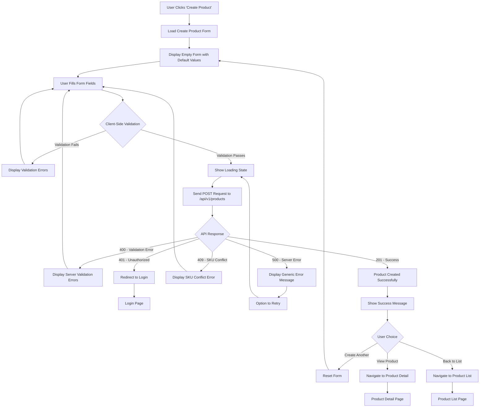

# Product Creation Flow - Detailed Process

## Overview

This document provides a detailed step-by-step flow for product creation in the admin interface, including all validation points, API interactions, and user feedback mechanisms.

## Product Creation Flow Diagram



## Detailed Step-by-Step Process

### Phase 1: Form Initialization

#### Step 1: Load Create Product Form
```typescript
const initializeCreateForm = () => {
  const defaultFormData: CreateProductRequest = {
    name: '',
    sku: '',
    base_price: 0,
    track_inventory: true,
    stock_quantity: 0,
    low_stock_threshold: 10,
    status: 'draft', // Default status
  };
  
  setFormData(defaultFormData);
  setErrors({});
  setIsSubmitting(false);
};
```

#### Step 2: Form Field Configuration
```typescript
const formFields = [
  // Required Fields Section
  {
    section: 'Basic Information',
    fields: [
      { name: 'name', label: 'Product Name', type: 'text', required: true },
      { name: 'sku', label: 'SKU', type: 'text', required: true },
      { name: 'base_price', label: 'Base Price', type: 'number', required: true },
    ]
  },
  
  // Optional Fields Section
  {
    section: 'Additional Details',
    fields: [
      { name: 'description', label: 'Description', type: 'textarea' },
      { name: 'category_id', label: 'Category', type: 'select' },
      { name: 'brand', label: 'Brand', type: 'text' },
      { name: 'tags', label: 'Tags', type: 'tag-input' },
    ]
  },
  
  // Pricing Section
  {
    section: 'Pricing',
    fields: [
      { name: 'sale_price', label: 'Sale Price', type: 'number' },
      { name: 'cost_price', label: 'Cost Price', type: 'number' },
    ]
  },
  
  // Inventory Section
  {
    section: 'Inventory Management',
    fields: [
      { name: 'track_inventory', label: 'Track Inventory', type: 'checkbox' },
      { name: 'stock_quantity', label: 'Stock Quantity', type: 'number' },
      { name: 'low_stock_threshold', label: 'Low Stock Threshold', type: 'number' },
    ]
  },
  
  // Physical Attributes Section
  {
    section: 'Physical Attributes',
    fields: [
      { name: 'weight', label: 'Weight (kg)', type: 'number' },
      { name: 'dimensions_length', label: 'Length (cm)', type: 'number' },
      { name: 'dimensions_width', label: 'Width (cm)', type: 'number' },
      { name: 'dimensions_height', label: 'Height (cm)', type: 'number' },
    ]
  },
  
  // SEO Section
  {
    section: 'SEO & Marketing',
    fields: [
      { name: 'meta_title', label: 'Meta Title', type: 'text' },
      { name: 'meta_description', label: 'Meta Description', type: 'textarea' },
      { name: 'slug', label: 'URL Slug', type: 'text' },
    ]
  },
];
```

### Phase 2: Form Validation

#### Step 3: Real-time Field Validation
```typescript
const validateField = (fieldName: string, value: any): string | null => {
  switch (fieldName) {
    case 'name':
      if (!value?.trim()) return 'Product name is required';
      if (value.length > 255) return 'Product name must be less than 255 characters';
      return null;
      
    case 'sku':
      if (!value?.trim()) return 'SKU is required';
      if (value.length < 3) return 'SKU must be at least 3 characters';
      if (value.length > 100) return 'SKU must be less than 100 characters';
      if (!/^[A-Z0-9_-]+$/.test(value)) return 'SKU must contain only uppercase letters, numbers, underscores, and hyphens';
      return null;
      
    case 'base_price':
      if (!value || value <= 0) return 'Base price must be greater than 0';
      if (value > 999999.99) return 'Base price is too high';
      return null;
      
    case 'sale_price':
      if (value && value < 0) return 'Sale price cannot be negative';
      if (value && formData.base_price && value > formData.base_price) {
        return 'Sale price cannot be higher than base price';
      }
      return null;
      
    case 'stock_quantity':
      if (value < 0) return 'Stock quantity cannot be negative';
      return null;
      
    case 'weight':
      if (value && value < 0) return 'Weight cannot be negative';
      if (value && value > 1000) return 'Weight seems too high (max 1000kg)';
      return null;
      
    default:
      return null;
  }
};
```

#### Step 4: Complete Form Validation
```typescript
const validateCompleteForm = (data: CreateProductRequest): ValidationErrors => {
  const errors: ValidationErrors = {};
  
  // Validate all fields
  Object.keys(data).forEach(fieldName => {
    const error = validateField(fieldName, data[fieldName]);
    if (error) {
      errors[fieldName] = error;
    }
  });
  
  // Cross-field validation
  if (data.sale_price && data.base_price && data.sale_price > data.base_price) {
    errors.sale_price = 'Sale price cannot be higher than base price';
  }
  
  if (data.cost_price && data.sale_price && data.cost_price > data.sale_price) {
    errors.cost_price = 'Cost price should not be higher than sale price';
  }
  
  // Business logic validation
  if (data.track_inventory && data.stock_quantity === undefined) {
    errors.stock_quantity = 'Stock quantity is required when tracking inventory';
  }
  
  return errors;
};
```

### Phase 3: API Submission

#### Step 5: Pre-submission Processing
```typescript
const prepareSubmissionData = (formData: CreateProductRequest): CreateProductRequest => {
  const submissionData = { ...formData };
  
  // Clean up empty strings and convert to null
  Object.keys(submissionData).forEach(key => {
    if (submissionData[key] === '') {
      submissionData[key] = null;
    }
  });
  
  // Generate slug if not provided
  if (!submissionData.slug && submissionData.name) {
    submissionData.slug = generateSlug(submissionData.name);
  }
  
  // Ensure numeric fields are properly typed
  if (submissionData.base_price) {
    submissionData.base_price = Number(submissionData.base_price);
  }
  
  if (submissionData.sale_price) {
    submissionData.sale_price = Number(submissionData.sale_price);
  }
  
  return submissionData;
};

const generateSlug = (name: string): string => {
  return name
    .toLowerCase()
    .replace(/[^a-z0-9\s-]/g, '') // Remove special characters
    .replace(/\s+/g, '-') // Replace spaces with hyphens
    .replace(/-+/g, '-') // Replace multiple hyphens with single
    .trim();
};
```

#### Step 6: API Request with Error Handling
```typescript
const submitProduct = async (formData: CreateProductRequest): Promise<ProductResponse> => {
  const submissionData = prepareSubmissionData(formData);
  
  try {
    setIsSubmitting(true);
    setSubmissionError(null);
    
    const response = await fetch('/api/v1/products', {
      method: 'POST',
      headers: {
        'Authorization': `Bearer ${getAccessToken()}`,
        'Content-Type': 'application/json',
      },
      body: JSON.stringify(submissionData),
    });
    
    const result = await response.json();
    
    if (!response.ok) {
      throw new APIError(result.message, response.status, result.errors);
    }
    
    return result.data;
    
  } catch (error) {
    if (error instanceof APIError) {
      handleAPIError(error);
    } else {
      console.error('Network error:', error);
      setSubmissionError('Network error. Please check your connection and try again.');
    }
    throw error;
  } finally {
    setIsSubmitting(false);
  }
};
```

### Phase 4: Response Handling

#### Step 7: Success Response Processing
```typescript
const handleSuccessfulCreation = (newProduct: ProductResponse) => {
  // Show success message
  showSuccessNotification({
    title: 'Product Created Successfully!',
    message: `${newProduct.name} has been created with SKU: ${newProduct.sku}`,
    duration: 5000,
  });
  
  // Log analytics event
  trackEvent('product_created', {
    product_id: newProduct.id,
    product_name: newProduct.name,
    category_id: newProduct.category_id,
    base_price: newProduct.base_price,
  });
  
  // Update local cache/state
  addProductToCache(newProduct);
  
  // Provide user options
  setShowSuccessActions(true);
};

const SuccessActions: React.FC = () => (
  <div className="success-actions">
    <h3>What would you like to do next?</h3>
    <div className="action-buttons">
      <button onClick={createAnotherProduct}>
        Create Another Product
      </button>
      <button onClick={() => navigateToProduct(newProduct.id)}>
        View Product Details
      </button>
      <button onClick={navigateToProductList}>
        Back to Product List
      </button>
    </div>
  </div>
);
```

#### Step 8: Error Response Processing
```typescript
const handleAPIError = (error: APIError) => {
  switch (error.status) {
    case 400:
      // Validation errors
      if (error.errors && error.errors.length > 0) {
        const fieldErrors: ValidationErrors = {};
        error.errors.forEach(err => {
          fieldErrors[err.field] = err.message;
        });
        setErrors(fieldErrors);
        
        // Focus on first error field
        const firstErrorField = error.errors[0].field;
        focusField(firstErrorField);
        
        showErrorNotification({
          title: 'Validation Error',
          message: 'Please correct the highlighted fields and try again.',
        });
      } else {
        showErrorNotification({
          title: 'Invalid Data',
          message: error.message,
        });
      }
      break;
      
    case 401:
      // Authentication error
      showErrorNotification({
        title: 'Authentication Required',
        message: 'Your session has expired. Please log in again.',
      });
      setTimeout(() => redirectToLogin(), 2000);
      break;
      
    case 409:
      // SKU conflict
      setErrors({ sku: 'A product with this SKU already exists' });
      focusField('sku');
      showErrorNotification({
        title: 'SKU Conflict',
        message: 'Please choose a different SKU.',
      });
      break;
      
    case 500:
      // Server error
      showErrorNotification({
        title: 'Server Error',
        message: 'An unexpected error occurred. Please try again in a few moments.',
      });
      setShowRetryOption(true);
      break;
      
    default:
      showErrorNotification({
        title: 'Error',
        message: error.message || 'An unexpected error occurred.',
      });
  }
};
```

## Form State Management

### State Structure
```typescript
interface ProductFormState {
  formData: CreateProductRequest;
  errors: ValidationErrors;
  isSubmitting: boolean;
  submissionError: string | null;
  showSuccessActions: boolean;
  showRetryOption: boolean;
  isDirty: boolean;
  touchedFields: Set<string>;
}

const initialState: ProductFormState = {
  formData: {
    name: '',
    sku: '',
    base_price: 0,
    track_inventory: true,
    stock_quantity: 0,
    low_stock_threshold: 10,
  },
  errors: {},
  isSubmitting: false,
  submissionError: null,
  showSuccessActions: false,
  showRetryOption: false,
  isDirty: false,
  touchedFields: new Set(),
};
```

### State Actions
```typescript
type FormAction = 
  | { type: 'UPDATE_FIELD'; field: string; value: any }
  | { type: 'SET_ERRORS'; errors: ValidationErrors }
  | { type: 'CLEAR_ERROR'; field: string }
  | { type: 'SET_SUBMITTING'; isSubmitting: boolean }
  | { type: 'SET_SUBMISSION_ERROR'; error: string | null }
  | { type: 'RESET_FORM' }
  | { type: 'MARK_FIELD_TOUCHED'; field: string };

const formReducer = (state: ProductFormState, action: FormAction): ProductFormState => {
  switch (action.type) {
    case 'UPDATE_FIELD':
      return {
        ...state,
        formData: { ...state.formData, [action.field]: action.value },
        isDirty: true,
        errors: { ...state.errors, [action.field]: undefined },
      };
      
    case 'SET_ERRORS':
      return { ...state, errors: action.errors };
      
    case 'CLEAR_ERROR':
      const newErrors = { ...state.errors };
      delete newErrors[action.field];
      return { ...state, errors: newErrors };
      
    case 'SET_SUBMITTING':
      return { ...state, isSubmitting: action.isSubmitting };
      
    case 'MARK_FIELD_TOUCHED':
      return {
        ...state,
        touchedFields: new Set([...state.touchedFields, action.field]),
      };
      
    case 'RESET_FORM':
      return initialState;
      
    default:
      return state;
  }
};
```

## User Experience Enhancements

### Auto-save Draft
```typescript
const useAutoSave = (formData: CreateProductRequest, isDirty: boolean) => {
  useEffect(() => {
    if (!isDirty) return;
    
    const timeoutId = setTimeout(() => {
      saveDraft(formData);
    }, 2000); // Auto-save after 2 seconds of inactivity
    
    return () => clearTimeout(timeoutId);
  }, [formData, isDirty]);
};

const saveDraft = async (formData: CreateProductRequest) => {
  try {
    await localStorage.setItem('product_draft', JSON.stringify(formData));
    showToast('Draft saved', 'info');
  } catch (error) {
    console.warn('Failed to save draft:', error);
  }
};
```

### Form Navigation Warning
```typescript
const useUnsavedChangesWarning = (isDirty: boolean) => {
  useEffect(() => {
    const handleBeforeUnload = (e: BeforeUnloadEvent) => {
      if (isDirty) {
        e.preventDefault();
        e.returnValue = 'You have unsaved changes. Are you sure you want to leave?';
      }
    };
    
    window.addEventListener('beforeunload', handleBeforeUnload);
    return () => window.removeEventListener('beforeunload', handleBeforeUnload);
  }, [isDirty]);
};
```

### Progressive Enhancement
```typescript
const FormSection: React.FC<{ section: FormSection; isExpanded: boolean }> = ({
  section,
  isExpanded,
}) => {
  const [isCollapsed, setIsCollapsed] = useState(!isExpanded);
  
  return (
    <div className={`form-section ${isCollapsed ? 'collapsed' : 'expanded'}`}>
      <div 
        className="section-header"
        onClick={() => setIsCollapsed(!isCollapsed)}
      >
        <h3>{section.title}</h3>
        <ChevronIcon direction={isCollapsed ? 'down' : 'up'} />
      </div>
      
      {!isCollapsed && (
        <div className="section-content">
          {section.fields.map(field => (
            <FormField key={field.name} field={field} />
          ))}
        </div>
      )}
    </div>
  );
};
```

## Testing Checklist

### Unit Tests
- [ ] Form validation functions
- [ ] API request/response handling
- [ ] State management reducers
- [ ] Utility functions (slug generation, etc.)

### Integration Tests
- [ ] Complete form submission flow
- [ ] Error handling scenarios
- [ ] Auto-save functionality
- [ ] Navigation warnings

### E2E Tests
- [ ] Successful product creation
- [ ] Validation error handling
- [ ] Network error scenarios
- [ ] Authentication expiration
- [ ] SKU conflict resolution

### Accessibility Tests
- [ ] Keyboard navigation
- [ ] Screen reader compatibility
- [ ] Focus management
- [ ] Error announcement

This comprehensive flow ensures a robust, user-friendly product creation experience with proper error handling, validation, and user feedback at every step.